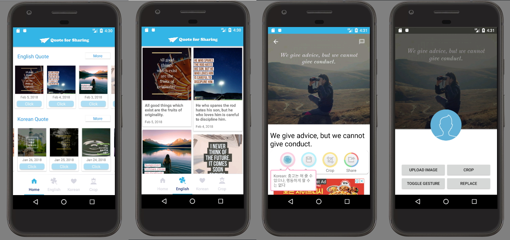

## Screenshot - Android app with Wordpress



## The purpose of the project

To help people interested in learning either Korean or English using pictures of quotes which are translated by using the Android application.


## the project summary

* **Gson/Json Parsing Using Restrofit2** - I have developed using Restrofit2 to convert the REST API in the Java interface.
* **Custom Wordpress plugin** - I designed this entire app with Bootstrap responsive grid system, prebuilt components, and plugins built on jQuery. I also used the html5 feature.
* **Android UI Design** -  I created and modified web site images using Photoshop.

Download Link : https://play.google.com/store/apps/details?id=com.knily.awesomequote


## Programming code description
### PHP MVC Framework - Controller


```java
private static final Retrofit.Builder retrofitBuilder = new Retrofit.Builder().baseUrl(base_URL)
            .addConverterFactory(GsonConverterFactory.create());
    public static <T> T createService(Class<T> serviceClass) {
        addLoggingInterceptor(httpClient);
        Retrofit retrofit = retrofitBuilder.
                client(httpClient.build())
                .build();
        return retrofit.create(serviceClass);
    }
        ......
    public static Retrofit provideRetrofit (String baseUrl)
    {
        return new Retrofit.Builder()
                .baseUrl( baseUrl )
                .client( provideOkHttpClient() )
                .addConverterFactory( GsonConverterFactory.create() )
                .build();
    }

    private static OkHttpClient provideOkHttpClient ()
    {
        if (client == null) {
            client = new OkHttpClient.Builder()
                    .addInterceptor(provideHttpLoggingInterceptor())
                    .addInterceptor(provideOfflineCacheInterceptor())
                    .addNetworkInterceptor(provideCacheInterceptor())
                    .cache(provideCache())
                    .build();
        }
        return client;
    }
?>

```

